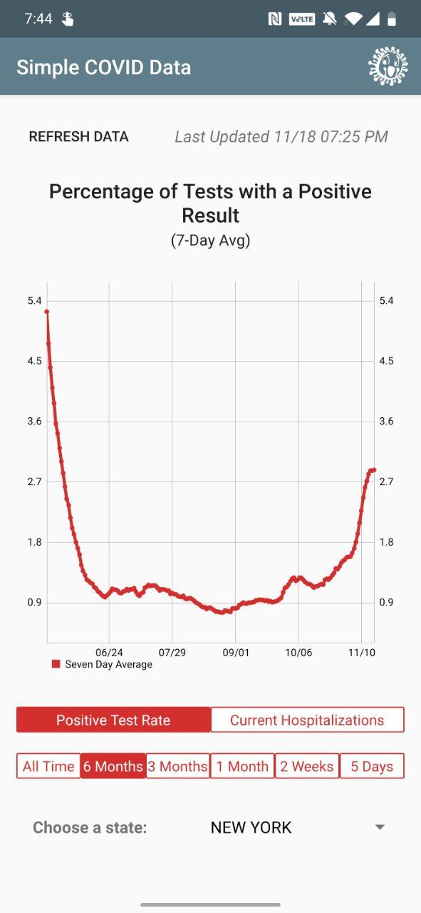

# Simple COVID Data

This is a simple app for tracking some Coronavirus stats. The app is available in the Play Store here.

The app uses Room to store daily data and auto updates once every 24 hours.

Data gathered from the [The COVID Tracking Project](https://github.com/COVID19Tracking)